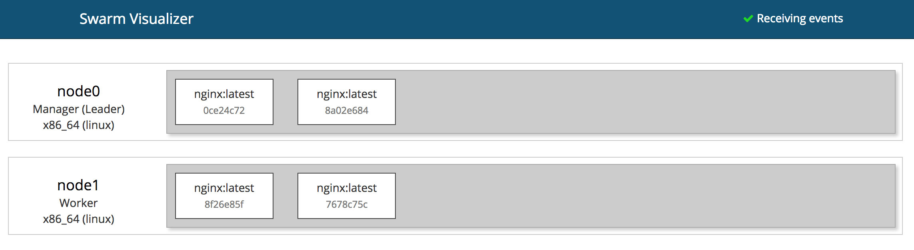
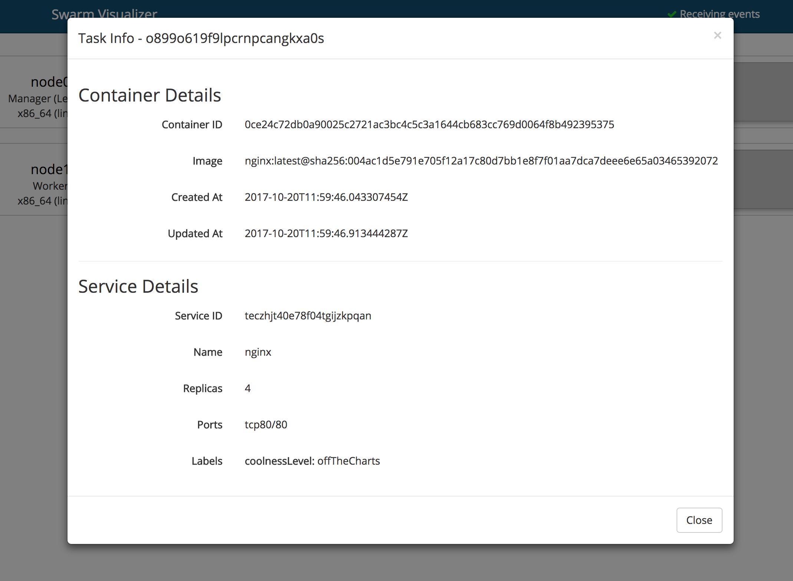

# Swarm Visualizer


This project is serving as an updated version of the Swarm Visualizer found at https://github.com/dockersamples/docker-swarm-visualizer.






## Why another one?

- It's event driven (well, sorta... tasks don't generate events yet, but we'll ignore that for now)
- Less clutter. Only the essential details are present, but more details are available with just a click
- Allows for more than three nodes. Have more nodes? It'll just keep adding another row!


## Running the visualizer

### Linux/Mac

Running as container:

```
docker container run \
  --name swarm-viz \
  -p 3000:3000 \
  -v /var/run/docker.sock:/var/run/docker.sock \
  mikesir87/swarm-viz
```

### Windows Server 1709

Run as Windows container:

```
docker container run `
  --name swarm-viz `
  -p 3000:3000 `
  -u ContainerAdministrator `
  -v //./pipe/docker_engine://./pipe/docker_engine `
  mikesir87/swarm-viz
```

## Development

From the root directory, simply run

```
docker-compose up -d
```

The backend (api) is found in the `/api` directory and the frontend is found in the `/client` directory.

## Build

### Windows

At the moment there is no official node image for Windows. Therefore apply another base image to build the app.

```
docker build -t mikesir87/swarm-viz --build-arg node=stefanscherer/node-windows:1709 .
```
